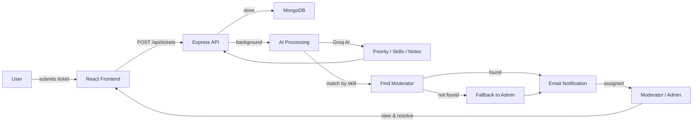

<p align="center">
  <strong><span style="font-size: 2.5em;">Sortify</span></strong>
  <br />
  <em>AI-powered support ticket triage — categorize, prioritize, and assign in seconds.</em>
</p>

<p align="center">
  
  
  
  
  
  
</p>

<p align="center">
  <a href="#demo">Demo</a> ·
  <a href="#features">Features</a> ·
  <a href="#getting-started">Getting Started</a> ·
  <a href="#tech-stack">Tech Stack</a> ·
  <a href="#architecture">Architecture</a> ·
  <a href="#roadmap">Roadmap</a>
</p>

<details>
  <summary>Table of Contents</summary>

  - [Features](#features)
  - [Tech Stack](#tech-stack)
  - [Architecture](#architecture)
  - [Getting Started](#getting-started)
    - [Prerequisites](#prerequisites)
    - [Backend setup](#backend-setup)
    - [Frontend setup](#frontend-setup)
  - [Usage / API Reference](#usage--api-reference)
  - [Testing admin vs user access](#testing-admin-vs-user-access)
  - [Roadmap](#roadmap)
  - [Contributing](#contributing)
  - [License & Acknowledgments](#license--acknowledgments)

</details>

---

## Features

| Icon | Feature | Description |
|------|---------|-------------|
| 🤖 | **AI-powered triage** | Auto-categorizes tickets, assigns priority (critical / high / medium / low), and generates helpful moderator notes via Groq AI (Llama 3) |
| 🎯 | **Smart assignment** | Matches tickets to moderators whose skills best fit the issue; falls back to admin if no match |
| 🔐 | **Role-based access** | Three tiers — User (submit tickets), Moderator (resolve tickets), Admin (manage users, roles, skills) |
| ⚡ | **Background processing** | AI analysis runs inline without blocking the response — no queue system needed |
| 📧 | **Automated emails** | Welcome email on signup, assignment notification to matched moderators (via Resend) |
| 🌗 | **Light / dark theme** | Full monochrome theme toggle with `localStorage` persistence — no color accents, just grayscale |

---

## Tech Stack

### Frontend

<p align="center">
  
  
  
  
  
</p>

### Backend

<p align="center">
  
  
  
  
  
</p>

### AI & Infra

<p align="center">
  
  
  
</p>

---

## Architecture



**Flow summary:**

1. User creates a ticket via the React frontend
2. Express API stores it in MongoDB and triggers AI analysis in background
3. Groq AI (Llama 3) generates priority, skill tags, and helpful notes
4. System matches a moderator by skill (regex-based), falling back to admin
5. Assigned moderator receives an email notification (if Resend is configured)
6. Moderator views, updates, and resolves the ticket

---

## Getting Started

### Prerequisites

| Tool | Version | Purpose |
|------|---------|---------|
| Node.js | v14+ | Runtime |
| MongoDB | any recent | Database |
| Groq API key | — | AI analysis (get from [Groq Console](https://console.groq.com/keys)) |
| Resend API key | free tier | Email delivery (get from [Resend](https://resend.com)) |

### Backend setup

```bash
# Clone the repo
git clone <repository-url>
```

```bash
# Navigate to the backend
cd ai-ticket-assistant
```

```bash
# Install dependencies
npm install
```

```bash
# Copy and edit environment variables
cp .env.sample .env
```

**Backend environment variables:**

| Variable | Description | Example |
|----------|-------------|---------|
| `MONGO_URI` | MongoDB connection string | `mongodb://localhost:27017/sortify` |
| `JWT_SECRET` | Secret key for signing tokens | `your-secret-key` |
| `RESEND_API_KEY` | Resend API key for email (get from [resend.com](https://resend.com)) | `re_...` |
| `GROQ_API_KEY` | Groq API key for AI analysis (get from [console.groq.com](https://console.groq.com/keys)) | |
| `APP_URL` | Application base URL | `http://localhost:3000` |
| `RESEND_FROM` | (Optional) Verified sender address | `Sortify <no-reply@yourdomain.com>` |

```bash
# Start the API server (http://localhost:3000)
npm run dev
```

```bash
# In a separate terminal, start the Inngest dev server (http://localhost:8288)
npm run inngest-dev
```

### Frontend setup

```bash
# In a new terminal — navigate to the frontend
cd ai-ticket-frontend
```

```bash
# Install dependencies
npm install
```

```bash
# Create a .env file with the API URL
echo "VITE_SERVER_URL=http://localhost:3000" > .env
```

**Frontend environment variables:**

| Variable | Description | Example |
|----------|-------------|---------|
| `VITE_SERVER_URL` | Backend API base URL | `http://localhost:3000` |

```bash
# Start the dev server (http://localhost:5173)
npm run dev
```

Both servers must be running simultaneously. Open `http://localhost:5173` in your browser.

---

## Usage / API Reference

<details>
  <summary><strong>Authentication</strong></summary>

  **POST** `/api/auth/signup` — Register a new user

  ```
  Headers: Content-Type: application/json
  Body:    { "email": "user@example.com", "password": "secret" }
  ```

  ```bash
  curl -X POST http://localhost:3000/api/auth/signup \
    -H "Content-Type: application/json" \
    -d '{ "email": "user@example.com", "password": "secret" }'
  ```

  **POST** `/api/auth/login` — Login and receive a JWT token

  ```
  Headers: Content-Type: application/json
  Body:    { "email": "user@example.com", "password": "secret" }
  ```

  ```bash
  curl -X POST http://localhost:3000/api/auth/login \
    -H "Content-Type: application/json" \
    -d '{ "email": "user@example.com", "password": "secret" }'
  ```

  Response: `{ "user": {...}, "token": "eyJ..." }`

</details>

<details>
  <summary><strong>Tickets</strong></summary>

  **POST** `/api/tickets` — Create a new ticket (authenticated)

  ```
  Headers: Content-Type: application/json
           Authorization: Bearer <token>
  Body:    { "title": "...", "description": "..." }
  ```

  ```bash
  curl -X POST http://localhost:3000/api/tickets \
    -H "Content-Type: application/json" \
    -H "Authorization: Bearer YOUR_JWT_TOKEN" \
    -d '{ "title": "Database Connection Issue", "description": "Experiencing intermittent timeouts" }'
  ```

  **GET** `/api/tickets` — List tickets for the logged-in user (authenticated)

  ```bash
  curl http://localhost:3000/api/tickets \
    -H "Authorization: Bearer YOUR_JWT_TOKEN"
  ```

  **GET** `/api/tickets/:id` — Get a single ticket (authenticated)

  ```bash
  curl http://localhost:3000/api/tickets/65a1b2c3d4e5f6a7b8c9d0e1 \
    -H "Authorization: Bearer YOUR_JWT_TOKEN"
  ```

</details>

<details>
  <summary><strong>Admin</strong></summary>

  **GET** `/api/auth/users` — List all users (admin only)

  ```bash
  curl http://localhost:3000/api/auth/users \
    -H "Authorization: Bearer ADMIN_JWT_TOKEN"
  ```

  **POST** `/api/auth/update-user` — Update user role & skills (admin only)

  ```
  Headers: Content-Type: application/json
           Authorization: Bearer <admin-token>
  Body:    { "email": "...", "role": "moderator", "skills": ["React", "MongoDB"] }
  ```

  ```bash
  curl -X POST http://localhost:3000/api/auth/update-user \
    -H "Content-Type: application/json" \
    -H "Authorization: Bearer ADMIN_JWT_TOKEN" \
    -d '{ "email": "mod@example.com", "role": "moderator", "skills": ["React", "MongoDB"] }'
  ```

</details>

---

## Testing admin vs user access

1. **Create two accounts** via the signup form:
   - A regular user account (defaults to `user` role)
   - A second account to promote to moderator

2. **Promote the second account** to moderator via the admin panel:

   ```bash
   # Login as the admin (first account gets auto-admin or update directly)
   curl -X POST http://localhost:3000/api/auth/login \
     -H "Content-Type: application/json" \
     -d '{ "email": "admin@example.com", "password": "..." }'
   ```

   ```bash
   # Update the second user's role
   curl -X POST http://localhost:3000/api/auth/update-user \
     -H "Content-Type: application/json" \
     -H "Authorization: Bearer ADMIN_TOKEN" \
     -d '{ "email": "mod@example.com", "role": "moderator", "skills": ["React", "Node.js"] }'
   ```

3. **Verify role gating** — a regular user cannot access admin endpoints:

   ```bash
   curl http://localhost:3000/api/auth/users \
     -H "Authorization: Bearer USER_TOKEN"
   # Expected: 403 Forbidden
   ```

4. **Submit a ticket as a regular user** — check that it appears in the list and triggers AI processing (visible via Inngest dev server at `http://localhost:8288`).

---

## Troubleshooting

### Port conflicts

```bash
# Find process using port 8288 (Inngest dev server)
lsof -i :8288

# Kill the process
kill -9 <PID>
```

### AI processing errors

- Verify `GROQ_API_KEY` in `.env` is set and valid
- Check Groq API quota and rate limits in [Groq Console](https://console.groq.com)
- Ensure the request body contains both `title` and `description`

### Email not sending

- Verify `RESEND_API_KEY` is set in `.env`
- Check [Resend dashboard](https://resend.com) for delivery logs
- In dev mode, emails use `onboarding@resend.dev` by default — no domain verification needed

### Build fails on frontend

```bash
# Clear Vite cache and reinstall
rm -rf node_modules dist
npm install
npm run build
```

---

## Roadmap

- [x] AI-powered ticket triage (priority, skills, helpful notes)
- [x] Role-based access (User / Moderator / Admin)
- [x] Background job processing via Inngest
- [x] Email notifications (signup welcome, ticket assignment)
- [x] Light/dark theme toggle
- [x] Admin panel with user management
- [ ] Ticket comments / threaded replies
- [ ] Moderator dashboard (assigned tickets overview)
- [ ] File attachments on ticket creation
- [ ] Real-time updates (WebSockets or polling)
- [ ] Analytics dashboard (ticket volume, resolution time)
- [ ] Ticket ownership/visibility enforcement (users see only their own tickets)
- [ ] Unit and integration tests


## License & Acknowledgments

**License:** MIT. See [LICENSE](./LICENSE) file.

Built with:

- [Inngest](https://www.inngest.com/) — background job processing and event-driven workflows
- [Groq](https://groq.com/) — AI-powered ticket analysis (Llama 3 via Groq API)
- [Resend](https://resend.com/) — email delivery API
- [MongoDB](https://www.mongodb.com/) — database
- [daisyUI](https://daisyui.com/) — UI component library for Tailwind CSS
