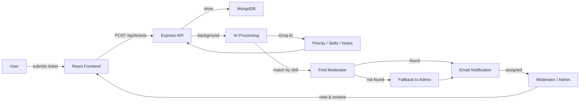

<p align="center">
  <strong><span style="font-size: 2.5em;">Sortify</span></strong>
  <br />
  <em>AI-powered support ticket triage — categorize, prioritize, and assign in seconds.</em>
</p>

<p align="center">
  
  
  
  
  
  
  
</p>

<p align="center">
  <a href="#features">Features</a> ·
  <a href="#getting-started">Getting Started</a> ·
  <a href="#tech-stack">Tech Stack</a> ·
  <a href="#architecture">Architecture</a> ·
  <a href="#email-setup">Email Setup</a>
</p>

<details>
  <summary>Table of Contents</summary>

  - [Features](#features)
  - [Tech Stack](#tech-stack)
  - [Architecture](#architecture)
  - [Getting Started](#getting-started)
    - [Prerequisites](#prerequisites)
    - [Backend setup](#backend-setup)
    - [Frontend setup](#frontend-setup)
  - [Email Setup](#email-setup)
  - [Usage / API Reference](#usage--api-reference)
  - [Testing the Full Flow](#testing-the-full-flow)
  - [Roadmap](#roadmap)
  - [Contributing](#contributing)
  - [License & Acknowledgments](#license--acknowledgments)

</details>

---

## Features

| Feature | Description |
|---------|-------------|
| **AI-powered triage** | Auto-categorizes tickets, assigns priority (critical / high / medium / low), and generates helpful moderator notes via Groq AI (Llama 3) |
| **Smart assignment** | Matches tickets to moderators whose skills best fit the issue; falls back to admin if no match |
| **Role-based access** | Three tiers — User (submit tickets), Moderator (resolve tickets), Admin (manage users, roles, skills) |
| **Email verification** | 6-digit code sent to email on signup — account only created after code verification |
| **Inline AI processing** | AI analysis runs in the background without blocking ticket creation |
| **Automatic email alerts** | Moderator notified on assignment; ticket creator notified when ticket is processed |
| **My Tickets filter** | Moderators see only their assigned tickets by default; toggle to view all |
| **Delete tickets** | Owners and admins can delete tickets from the detail page |
| **Admin panel** | Manage users, edit roles, update skills, filter by role |
| **Docs page** | `/docs` explains how the app works |
| **Light / dark theme** | Full monochrome theme toggle with localStorage persistence |

---

## Tech Stack

### Frontend

<p align="center">
  
  
  
  
  
</p>

### Backend

<p align="center">
  
  
  
  
  
</p>

### AI

<p align="center">
  
</p>

---

## Architecture



**Flow summary:**

1. User signs up — 6-digit verification code sent via email, must be entered to complete registration
2. User creates a ticket via the React frontend
3. Express API stores it in MongoDB and triggers AI analysis in background
4. Groq AI (Llama 3) generates priority, skill tags, and helpful notes
5. System matches a moderator by skill (regex-based), falling back to admin
6. Assigned moderator receives an email notification; ticket creator also gets a notification
7. Moderator views, updates, and resolves the ticket

---

## Getting Started

### Prerequisites

| Tool | Version | Purpose |
|------|---------|---------|
| Node.js | v14+ | Runtime |
| MongoDB | any recent | Database |
| Groq API key | — | AI analysis (get from [Groq Console](https://console.groq.com/keys)) |
| SMTP credentials | optional | Email delivery (see [Email Setup](#email-setup)) |

### Backend setup

```bash
# Clone the repo
git clone <repository-url>
```

```bash
# Navigate to the backend
cd ai-ticket-assistant
```

```bash
# Install dependencies
npm install
```

```bash
# Copy and edit environment variables
cp .env.sample .env
```

**Backend environment variables:**

| Variable | Required | Description |
|----------|----------|-------------|
| `MONGO_URI` | Yes | MongoDB connection string |
| `JWT_SECRET` | Yes | Secret key for signing tokens |
| `GROQ_API_KEY` | Yes | Groq API key for AI analysis |
| `APP_URL` | No | App base URL (default: `http://localhost:3000`) |
| `SMTP_HOST` | No | SMTP server host (skip for Ethereal testing) |
| `SMTP_PORT` | No | SMTP server port (default: 587) |
| `SMTP_USER` | No | SMTP username |
| `SMTP_PASS` | No | SMTP password / API key |
| `SMTP_FROM` | No | Sender address (default: `Sortify <sortify@ethereal.email>`) |
| `SMTP_SECURE` | No | `true` for port 465 SSL (default: false) |

```bash
# Start the API server (http://localhost:3000)
npm run dev
```

### Frontend setup

```bash
# In a new terminal — navigate to the frontend
cd ai-ticket-frontend
```

```bash
# Install dependencies
npm install
```

```bash
# Create a .env file with the API URL
echo "VITE_SERVER_URL=http://localhost:3000" > .env
```

**Frontend environment variables:**

| Variable | Description | Example |
|----------|-------------|---------|
| `VITE_SERVER_URL` | Backend API base URL | `http://localhost:3000` |

```bash
# Start the dev server (http://localhost:5173)
npm run dev
```

Both servers must be running simultaneously. Open `http://localhost:5173` in your browser.

---

## Email Setup

Sortify uses **Nodemailer** and supports any SMTP provider. Choose one:

### Option A: Ethereal (no setup, testing only)

No configuration needed — emails are captured and viewable via a preview URL in the console logs. Emails are never delivered to real inboxes.

### Option B: Gmail (free)

1. Enable **2-Step Verification** on your Google Account
2. Generate an **App Password** (Google Account → Security → 2-Step Verification → App passwords)
3. Set env vars:
   ```
   SMTP_HOST=smtp.gmail.com
   SMTP_PORT=587
   SMTP_USER=your.email@gmail.com
   SMTP_PASS=your-16-char-app-password
   SMTP_FROM=Sortify <your.email@gmail.com>
   ```

### Option C: SendGrid (free, 100 emails/day)

1. Sign up at [sendgrid.com](https://sendgrid.com)
2. Create a **Sender Identity** (Settings → Sender Authentication)
3. Create an **API Key** (Settings → API Keys → Full Access)
4. Set env vars:
   ```
   SMTP_HOST=smtp.sendgrid.net
   SMTP_PORT=587
   SMTP_USER=apikey
   SMTP_PASS=your-sendgrid-api-key
   SMTP_FROM=Sortify <your.verified.sender@gmail.com>
   ```

### Option D: Brevo (free, 300 emails/day)

1. Sign up at [brevo.com](https://brevo.com)
2. Create an **SMTP key** (SMTP & API → SMTP keys)
3. Create a **Sender Identity** (Sender Identity → Add a Sender)
4. Set env vars:
   ```
   SMTP_HOST=smtp-relay.brevo.com
   SMTP_PORT=587
   SMTP_USER=your.email@gmail.com
   SMTP_PASS=your-smtp-key
   SMTP_FROM=Sortify <your.email@gmail.com>
   ```

---

## Usage / API Reference

<details>
  <summary><strong>Authentication</strong></summary>

  **POST** `/api/auth/send-code` — Send a 6-digit verification code to email

  ```
  Headers: Content-Type: application/json
  Body:    { "email": "user@example.com" }
  ```

  **POST** `/api/auth/signup` — Register a new user (requires verification code)

  ```
  Headers: Content-Type: application/json
  Body:    { "email": "user@example.com", "password": "secret", "code": "123456" }
  ```

  **POST** `/api/auth/login` — Login and receive a JWT token

  ```
  Headers: Content-Type: application/json
  Body:    { "email": "user@example.com", "password": "secret" }
  ```

  Response: `{ "user": {...}, "token": "eyJ..." }`

</details>

<details>
  <summary><strong>Tickets</strong></summary>

  **POST** `/api/tickets` — Create a new ticket (authenticated)

  ```
  Headers: Content-Type: application/json
           Authorization: Bearer <token>
  Body:    { "title": "...", "description": "..." }
  ```

  AI analysis runs in the background — ticket priority and skills are updated automatically.

  **GET** `/api/tickets` — List tickets (authenticated)
  - Users: own tickets only
  - Moderators/Admins: all tickets (use `?assignedToMe=true` to filter)

  **GET** `/api/tickets/:id` — Get a single ticket (authenticated)

  **DELETE** `/api/tickets/:id` — Delete a ticket (owner or admin only)

</details>

<details>
  <summary><strong>Admin</strong></summary>

  **GET** `/api/auth/users` — List all users (admin only)

  **POST** `/api/auth/update-user` — Update user role & skills (admin only)

  ```
  Headers: Content-Type: application/json
           Authorization: Bearer <admin-token>
  Body:    { "email": "...", "role": "moderator", "skills": ["networking", "linux"] }
  ```

</details>

---

## Testing the Full Flow

1. **Create 4 accounts:**
   - First signup auto-becomes **admin**
   - Three more accounts (you can use the dev code from logs if email is not configured)

2. **Promote two accounts to moderator** via Admin panel (edit role + set skills):
   - Moderator 1: `networking`, `linux`, `security`
   - Moderator 2: `react`, `api`, `database`

3. **Create 3 tickets as a regular user:**
   - One networking/security issue → should match Moderator 1
   - One API/database issue → should match Moderator 2
   - One generic issue → falls back to admin

4. **Check assignment:**
   - Ticket detail page shows "Assigned to" field
   - Moderators see their assigned tickets with "My tickets" toggle

---

## Troubleshooting

### Email not sending

- Check console/logs for `Mailer:` lines — confirms SMTP configuration
- For Ethereal: look for `Ethereal preview:` URL in logs
- For SMTP: look for `Email sent:` or `Mail error:` in logs
- Verify sender identity if using SendGrid/Brevo

### AI not processing

- Verify `GROQ_API_KEY` is set and valid
- Check Groq API quota in [Groq Console](https://console.groq.com)
- Ensure ticket has both `title` and `description`

### Build fails on frontend

```bash
# Clear Vite cache and reinstall
rm -rf node_modules dist
npm install
npm run build
```

### Database reset

```bash
# Drop all collections (users, tickets, verification codes)
node scripts/resetDb.js
```

---

## Roadmap

- [x] AI-powered ticket triage (priority, skills, helpful notes)
- [x] Role-based access (User / Moderator / Admin)
- [x] Email notifications (verification, assignment, processing)
- [x] Light/dark theme toggle
- [x] Admin panel with user management
- [x] Email verification on signup
- [x] Terms & Privacy pages
- [x] Documentation page
- [x] My Tickets filter for moderators
- [x] Delete tickets (owner + admin)
- [ ] Ticket comments / threaded replies
- [ ] File attachments on ticket creation
- [ ] Real-time updates (WebSockets or polling)
- [ ] Analytics dashboard (ticket volume, resolution time)
- [ ] Unit and integration tests

## License & Acknowledgments

**License:** MIT. See [LICENSE](./LICENSE) file.

Built with:

- [Groq](https://groq.com/) — AI-powered ticket analysis (Llama 3 via Groq API)
- [Nodemailer](https://nodemailer.com/) — email delivery
- [MongoDB](https://www.mongodb.com/) — database
- [daisyUI](https://daisyui.com/) — UI component library for Tailwind CSS
